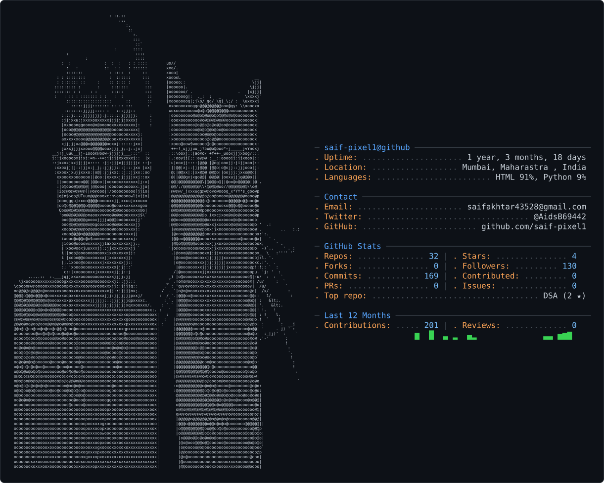

<picture>
  <source media="(prefers-color-scheme: dark)" srcset="dark_mode.svg" />
  <source media="(prefers-color-scheme: light)" srcset="light_mode.svg" />
  
</picture>

# Hi, I'm Saif Mansuri

**AI Engineer · AI Researcher · Data Scientist**

I build and study machine learning systems, with a particular interest in how models can learn, adapt, and evolve as data changes.

## Exploring

**→ Continual & Streaming Machine Learning** 
**→ Adaptive Ensemble Learning** 
**→ Deep Learning & Computer Vision** 
**→ LLMs & Intelligent Systems** 
**→ ML Research → Practical Implementations**

## Research

**→ HELIX** — A framework for self-evolving machine learning under concept drift. 
**→ Adaptive Ensemble Learning** — Multi-model blending and meta-learning architectures. 
**→ Single-Cell Developmental Modeling** — Studying developmental changes in the mouse visual cortex using single-cell data.

## Articles

**→ Neurogenesis** — Computational ideas inspired by biological development. 
**→ Data Mining of Twitter** — Large-scale text and data analysis.

## Currently

**→ Building research-driven AI/ML systems** 
**→ Turning research ideas into reproducible implementations** 
**→ Exploring the intersection of biological systems and machine learning** 
**→ Learning, experimenting, and documenting along the way**

## 🌐 Socials:
       

# 💻 Tech Stack:
             

# 📊 GitHub Stats:
 

---

